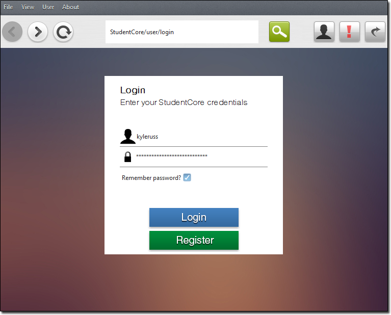
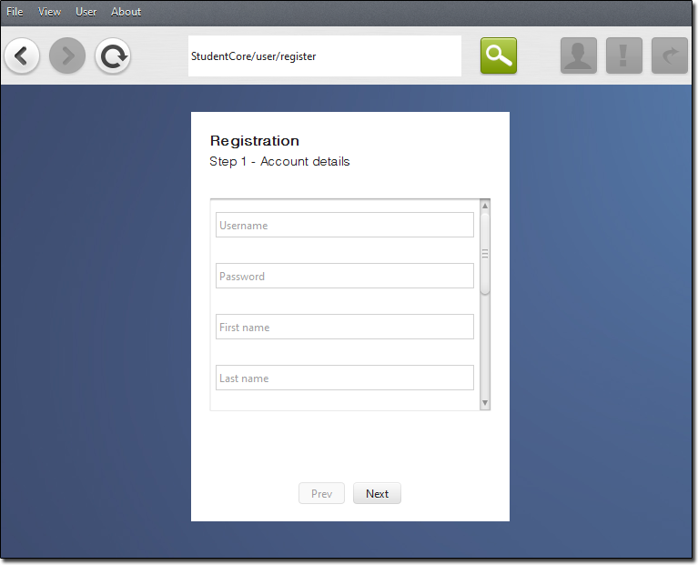
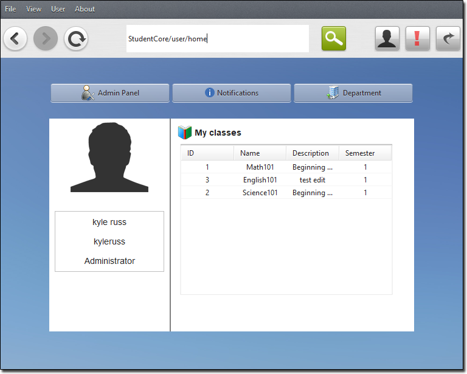
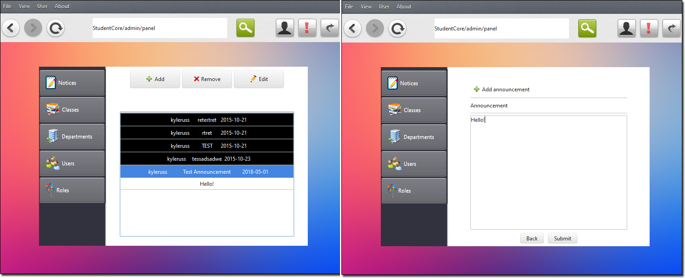
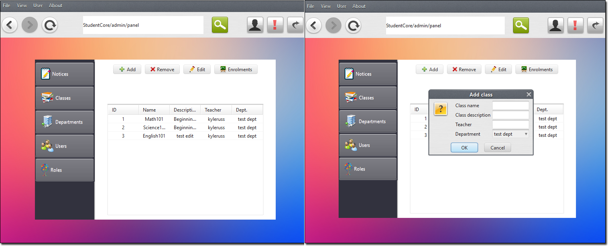
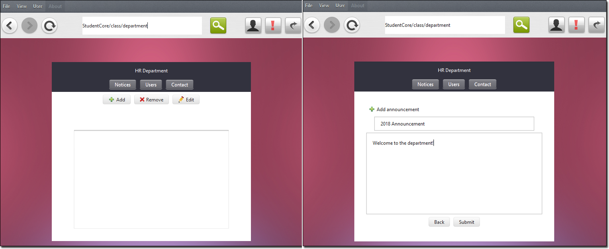
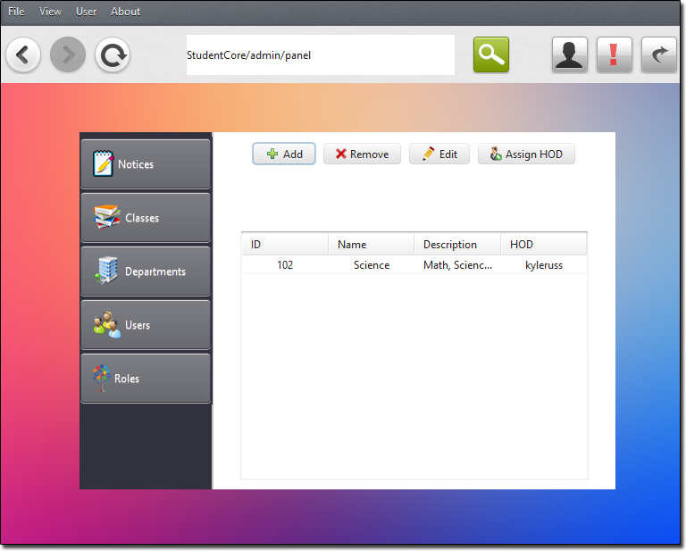
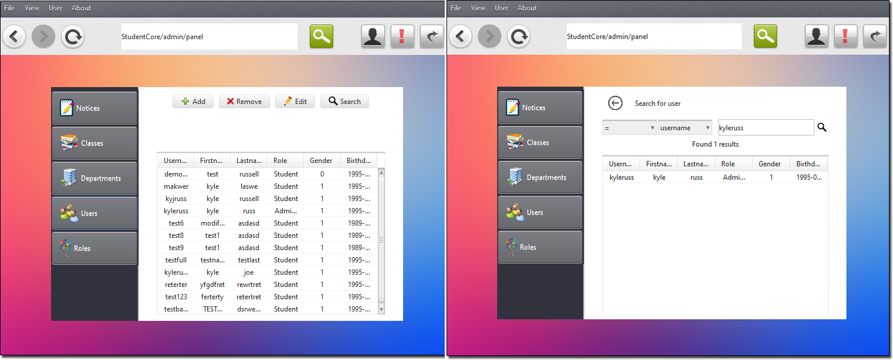
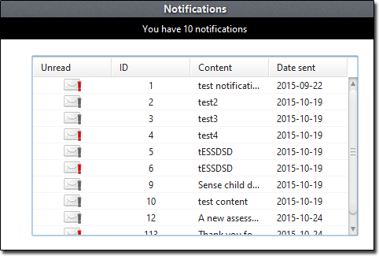

# StudentCore



[](https://forthebadge.com)

StudentCore is an education management system  
The software allows teachers to create, search and manage their classes, students, announcements and departments  
Students can use the software to receive important notifications, enrol in their classes and view their class announcements  
StudentCore's unique modular design motivated the development of the [jdamvc-framework](https://github.com/kyleruss/jdamvc-framework.git) 

## Features

#### Account registration  
StudentCore requires students and teachers to register with the service and login 



#### User home  
Once a user has successfully signed in they can view their home page  
Here users can view thier classes, go to their department page or manage admin if they are a teacher



#### Announcements
Teachers can create announcements for their students to view



#### Manage classes
Teachers can create, remove and edit classes  
They can also view all students enrolled in a class



#### Departments
Students and teachers can view their department home page  
Teachers can add announcements for department members to view



#### Manage Departments
Teachers can create, edit and remove departments



#### Manage Users
Teachers can add, remove, edit and search users



#### Manage Roles
Roles determine the permissions a user can have 
Teachers can create new roles, remove them, edit or assign a role to a user


#### Notifications
Users can recieve important notifications from their teachers and courses



## Getting started
### Prerequisites
- JDK 1.8
- NetBeans 8.1+
- Apache Derby

### Installation
- Clone the StudentCore repository
```
git clone https://github.com/kyleruss/student-core.git
```
- Copy the `SchoolDB` derby database into your database directory
- You can connect to the database using the following connection parameters
```
Host: localhost
Port: 1527
Driver: apache_derby_net
Driver class: ClientDriver
DB Username: kyleruss
DB Password: fgsmg2
```
- Import the StudentCore project into NetBeans
- Start SchoolDB derby database
- Build and run the project (or launch `StudentCore.exe` if you are using a [release](https://github.com/kyleruss/student-core/releases/latest))

## License
StudentCore is available under the MIT License  
See [LICENSE](License.txt) for more details
